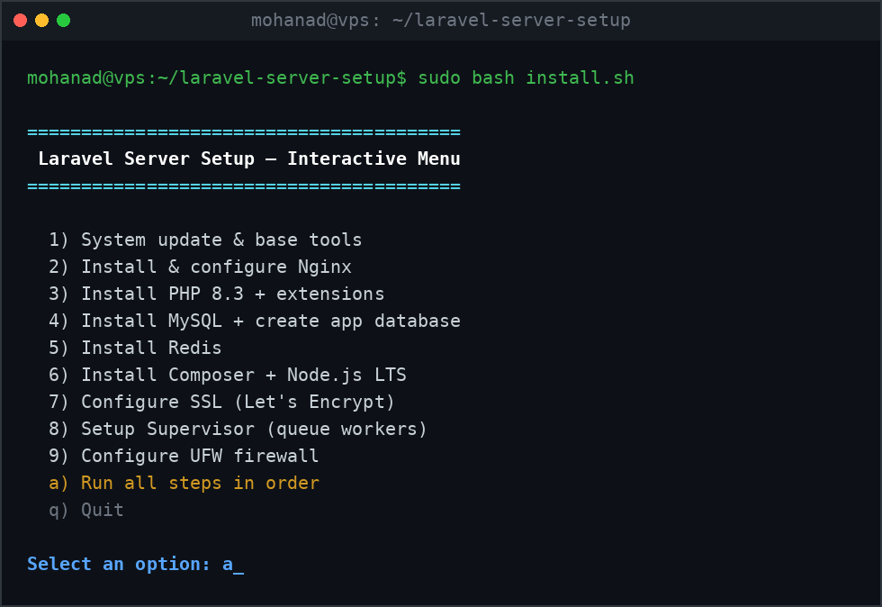
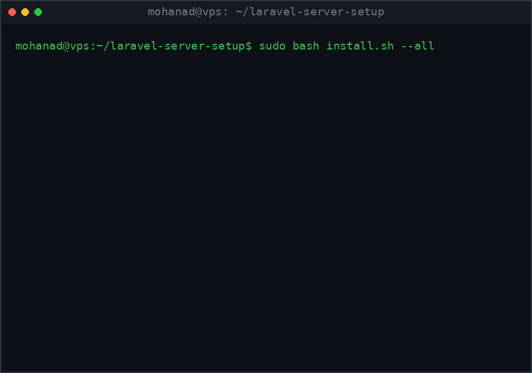
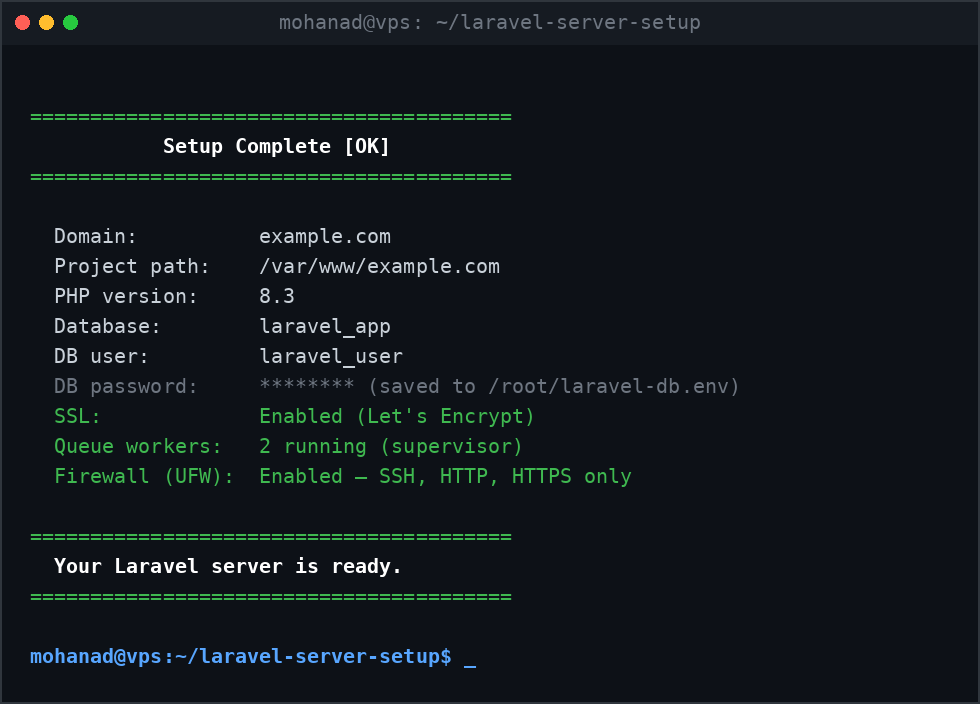

<div align="center">

# laravel-server-setup

**One command to turn a bare Ubuntu VPS into a production-ready Laravel host.**

[](LICENSE)
[](https://www.gnu.org/software/bash/)
[](#requirements)
[](.github/workflows/shellcheck.yml)

</div>

---

## Why this project?

Provisioning a Laravel server by hand means dozens of apt commands, config
files and security steps - easy to forget one, impossible to repeat exactly.
`laravel-server-setup` turns that whole checklist into **one interactive,
idempotent script**: fresh server to deployed-ready stack in about 10 minutes.

## Features

- **System baseline** - APT update/upgrade, timezone, base tooling
- **NGINX** - hardened Laravel vhost generated from a template
- **PHP-FPM 8.1-8.4** - via the ondrej/php PPA with every extension Laravel needs
- **MySQL** - automated `mysql_secure_installation`, dedicated app DB + user, strong random password (or your own), ready-to-paste `.env` snippet
- **Redis** - localhost-only, dangerous commands (`FLUSHALL`, `CONFIG`, `KEYS`) disabled
- **Composer** - latest release, sha384 checksum verified before install
- **Node.js LTS + npm + yarn** - official NodeSource repository for asset building
- **SSL** - Let's Encrypt certificates via Certbot with auto-renewal and HTTP-to-HTTPS redirect (skippable until DNS is ready)
- **Supervisor** - queue workers with automatic restart on failure
- **UFW firewall** - SSH (rate-limited) / HTTP / HTTPS only, with an explicit confirmation gate before enabling

Every step is **safe to re-run**: scripts detect what is already done and skip it.

## Requirements

| Requirement | Notes |
|---|---|
| Ubuntu 22.04 LTS or 24.04 LTS | Other releases are detected and refused |
| Root access | `sudo` or direct root login |
| Fresh server recommended | Existing web stacks may conflict with installed services |
| Domain (optional) | Needed only for the SSL step |

## Installation

```bash
git clone https://github.com/mohanadhassan110/laravel-server-setup.git
cd laravel-server-setup
sudo bash install.sh
```

## Usage

Run everything in order:

```bash
sudo bash install.sh --all
```

Pick specific steps only:

```bash
sudo bash install.sh --only 2,4     # NGINX then MySQL
```

Or just launch the interactive menu:

```bash
sudo bash install.sh
```

<!-- SCREENSHOT PLACEHOLDER: interactive main menu -->


<!-- GIF PLACEHOLDER: full run from bare VPS to summary -->


Individual steps can also be executed directly:

```bash
sudo bash scripts/04-install-mysql.sh   # MySQL + app database
sudo bash scripts/07-configure-ssl.sh    # SSL issuance/renewal
```

At the end you get a full summary - domain, project path, database credentials,
worker status and SSL/firewall state:

<!-- SCREENSHOT PLACEHOLDER: final summary output -->


## Configuration options

Answers are persisted to `.setup-config` (chmod `600`, git-ignored) so later
steps and re-runs reuse them. Recognized keys:

| Key | Set by | Purpose |
|---|---|---|
| `DOMAIN` | step 02 | Primary domain / vhost `server_name` |
| `PROJECT_PATH` | step 02 | Deployment directory (default `/var/www/<domain>`) |
| `PHP_VERSION` | step 03 | FPM version wired into nginx |
| `DB_NAME` / `DB_USER` / `DB_PASSWORD` | step 04 | Application database credentials |
| `SSL_STATUS` / `SSL_EMAIL` | step 07 | Certificate state + LE contact |
| `QUEUE_NAME` / `NUM_WORKERS` / `PROGRAM_NAME` | step 08 | Supervisor worker pool |
| `FIREWALL_STATUS` | step 09 | Whether UFW was enabled |

Database credentials are additionally written to `/root/laravel-db.env`
(Laravel `.env` syntax, chmod `600`) for copy-paste deployment.

## Security notes

- Redis listens on localhost only; destructive commands are renamed away
- MySQL root keeps socket-based auth; app user is scoped to its own schema
- UFW defaults to deny-incoming with a rate-limited SSH rule
- All secrets land in root-owned `600` files, never in the repository

## Roadmap

- [ ] CentOS / Rocky Linux support
- [ ] Multiple PHP versions side by side per vhost
- [ ] Docker / Docker Compose provisioning mode
- [ ] fail2ban + CrowdSec integration
- [ ] Automated Laravel project deploy step (git pull + migrations)
- [ ] Non-interactive "cloud-init" mode with a YAML answer file

## Contributing

PRs are welcome! Please read [CONTRIBUTING.md](CONTRIBUTING.md) first -
it covers branch naming, the commit convention and how to test changes on a
throwaway VM. Every push is linted by ShellCheck via GitHub Actions.

## License

Distributed under the [MIT License](LICENSE).
